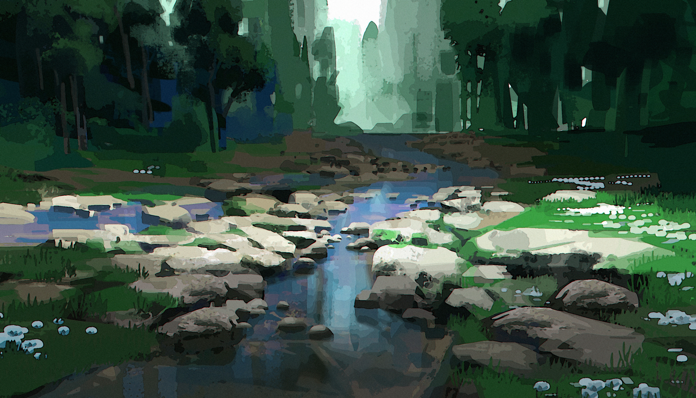

## This is my website exercise!


## Add links to your website

```{r}
# [text for link](address.of.link)

# add a page: when add a page, make sure knit the rmd file into html first.

# rmd_file_name.html
```

I can link to useful things like [google](https://www.google.com/) and [P8105](https://www.p8105.com/index.html)

I can make an extra page on my site and link to that, Here's Jeff's website [index](index.html).

## Add images

```{r}
# 
#  path and size
```





